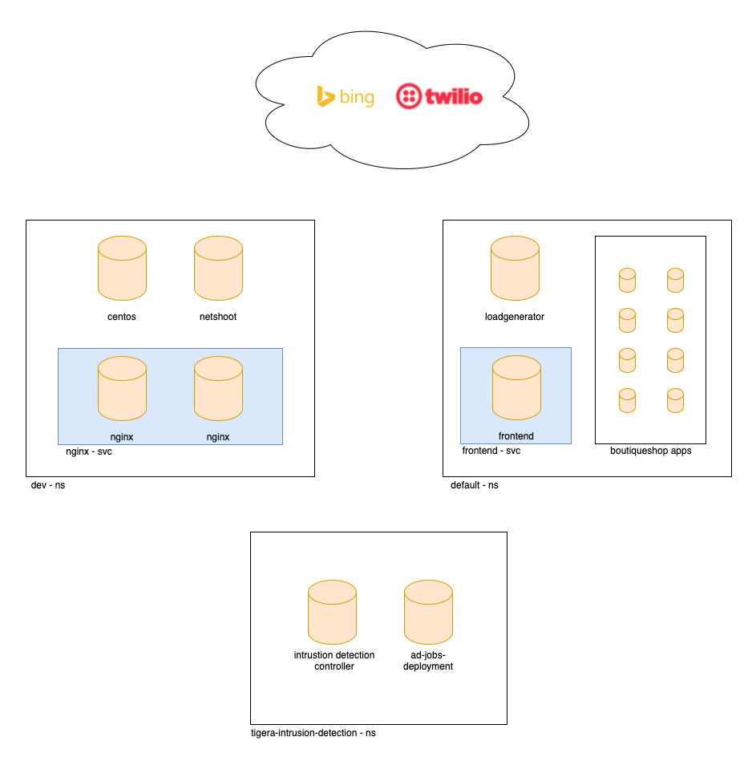

# Module 4: Configuring demo applications

**Goal:** Deploy and configure demo applications.

This workshop will deploy Namespace `dev` where several pods will be created to demonstrate connectivity within the Namespace and cross-Namespace to the `default` Namespace where the Boutiquestore (Microservices) Demo apps will be deployed. We will use a subset of these pods to demonstrate how Calico Network Policy can provide pod security and microsegmentation techniques. 
In [Module 13](../modules/anomaly-detection.md) we introduce Namespace `tigera-intrusion-detection` which contains specific Calico pods to run the Anomaly Detection engine.
<br>



## Steps

1. Download this repo into your environment:

    ```bash
    git clone https://github.com/chrisman-io/tigera-eks-workshop.git
    ```
    
    ```bash
    cd ./calicocloud-aks-workshop
    ```
2. Deploy policy tiers.

    We are going to deploy some policies into policy tier to take advantage of hierarcical policy management.

    ```bash
    kubectl apply -f demo/tiers/tiers.yaml
    ```

    This will add tiers `security` and `platform` to the Calico cluster.

2. Deploy base policy.

    In order to explicitly allow workloads to connect to the Kubernetes DNS component, we are going to implement a policy that controls such traffic.

    ```bash
    kubectl apply -f demo/10-security-controls/allow-kube-dns.yaml
    ```

3. Deploy demo applications.

    ```bash
    # deploy dev app stack
    kubectl apply -f demo/dev/app.manifests.yaml

    # deploy boutiqueshop app stack
    kubectl apply -f https://raw.githubusercontent.com/GoogleCloudPlatform/microservices-demo/master/release/kubernetes-manifests.yaml
    ```

4. Deploy compliance reports.

    >The reports will be needed for one of a later lab.

    ```bash
    kubectl apply -f demo/40-compliance-reports/daily-cis-results.yaml
    kubectl apply -f demo/40-compliance-reports/cluster-reports.yaml
    ```

5. Deploy global alerts.

    >The alerts will be explored in a later lab. Warning messages will appear whilst deploying the GlobalAlerts but these have no adverse effect.

    ```bash
    kubectl apply -f demo/50-alerts/globalnetworkset.changed.yaml
    kubectl apply -f demo/50-alerts/unsanctioned.dns.access.yaml
    kubectl apply -f demo/50-alerts/unsanctioned.lateral.access.yaml
    ```
6. Install curl on loadgenerator pod
 
    > Before we implement network secruity rules we need to install curl on the loadgenerator pod for testing purposes later in the workshop. Note the installation will not survive a reboot so repeat this installation as necessary

    ```bash
    ##install update package 
    kubectl exec -it $(kubectl get po -l app=loadgenerator -ojsonpath='{.items[0].metadata.name}') -- sh -c 'apt-get update'
    ## wait for 10 seconds
    sleep 10
    ##install curl 
    kubectl exec -it $(kubectl get po -l app=loadgenerator -ojsonpath='{.items[0].metadata.name}') -- sh -c 'apt install curl -y'
    ```

[Next -> Module 5](../modules/using-security-controls.md)
