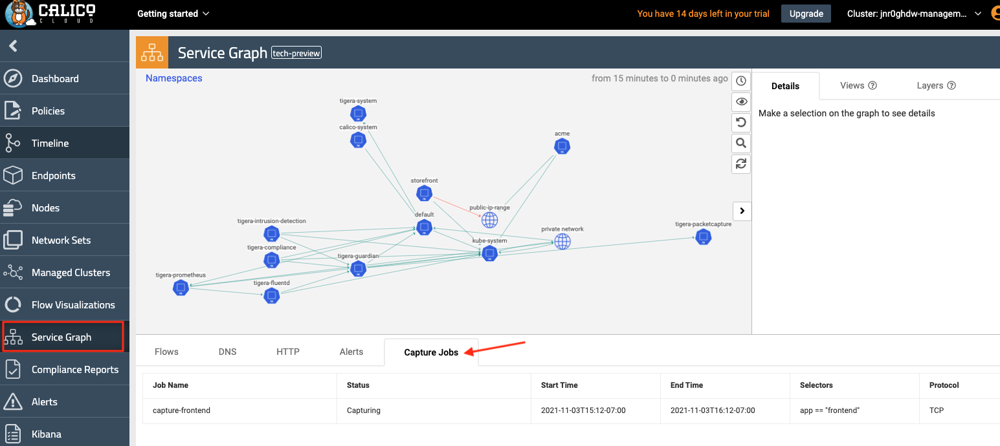
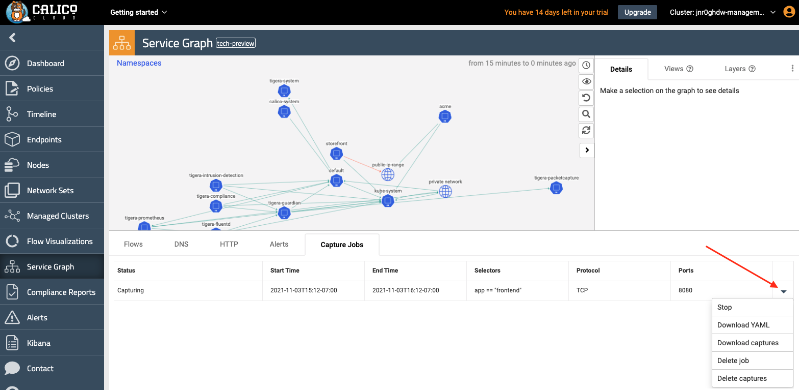
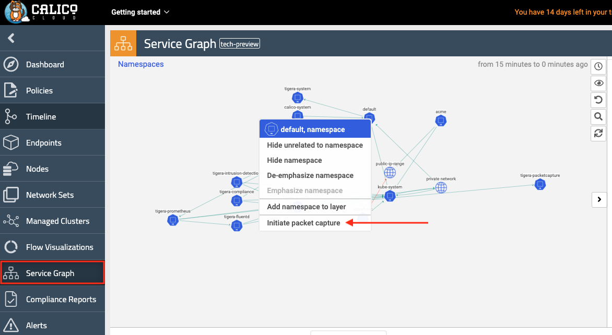

# Module 12: Dynamic packet capture

**Goal:** Configure packet capture for specific pods and review captured payload.

## Steps

1. Configure packet capture.

    Navigate to `demo/60-packet-capture` and review YAML manifests that represent packet capture definition. Each packet capture is configured by deploying a `PacketCapture` resource that targets endpoints using `selector` and `labels`. Filters `Protocol` and `Port` can also be used to selectively capture packets. 

    Deploy packet capture definition to capture packets for `default/frontend-*` pods.

    ```bash
    kubectl apply -f demo/60-packet-capture/frontend-pcap.yaml
    ```

    >Once the `PacketCapture` resource is deployed, Calico starts capturing packets for all endpoints configured in the `selector` field for `TCP` traffic on `Port` 8080.

2. Downloading pcap files

Since Calico Enterprise v3.10 there are 2 methods to obtain the pcap files

### a. Install and use `calicoctl` CLI 

    The easiest way to retrieve captured `*.pcap` files from CLI is to use [calicoctl](https://docs.tigera.io/maintenance/clis/calicoctl/).

```bash
    # download and configure calicoctl
    curl -o calicoctl -O -L https://downloads.tigera.io/ee/binaries/v3.10.0/calicoctl
    chmod +x calicoctl
    # move calicoctl into correct $PATH
    sudo mv calicoctl /usr/local/bin/
    # verify calicoctl is installed
    calicoctl version
```

Fetch and review captured payload.

>The captured `*.pcap` files are stored on the hosts where pods are running at the time the `PacketCapture` resource is active.

    Retrieve captured `*.pcap` files and review the content.

    ```bash
    # get pcap files
    calicoctl captured-packets copy capture-frontend --namespace default

    ls frontend-*
    # view *.pcap content
    tcpdump -Xr frontend-XXXXXX.pcap
    ```

Stop packet capture

>Stop packet capture by removing the `PacketCapture` resource.

    ```bash
    kubectl delete -f demo/60-packet-capture/frontend-pcap.yaml
    ```
### b. Download pcap via the Web UI 

Navigate to `Service Graph` in the UI and select the `Capture Jobs` tab. The newly created PacketCapture job should be displayed and is in `capturing` status

<br>



Scrolling the bottom pane to the right will display a drop down option which will bring up actions. The actions are:

- Stop: Stopping the Packet Capture
- Download YAML: Downloading the `PacketCapture` resource
- Download captures: Download the pcap files to local terminal
- Delete job: Stops any existing Packet Captures and deletes the `PacketCapture` resource
- Delete captures: Deletes any pcap files associated with a PacketCapture but leaves the job intact

<br>




>Follow the next steps to complete this module

Bring up the Capture Jobs options and click Stop. Then click  `Download captures` and save the pcap file to local terminal. The pcap file can be analysed via `TCPdump`, `Wireshark` or any other tool.

<br>

3. \<Optional> Create PacketCapture from the Web UI

It is possible to create packetcaptures directly from the UI. However, on Calico v3.10 it is only possible to create a Packetcapture at a Namespace level. This means a pcap file will be generated for each pod in the Namespace multiplied by the number of nodes a Deployment may span e.g. if a Deployment spans 3 worker nodes 3 separate pcap files for the Depployment will be created.

To create a PacketCapture from the UI click on Service Graph and highlight the Namespace where the captures should be created. Right click the Namespace and click on `Initiate packet capture`. The job can be scheduled and Protocol and Port filters can be created. Stop the packetcapture and download the pcap files as in step 2 above.


<br>


[Next -> Module 13](../modules/anomaly-detection.md)
